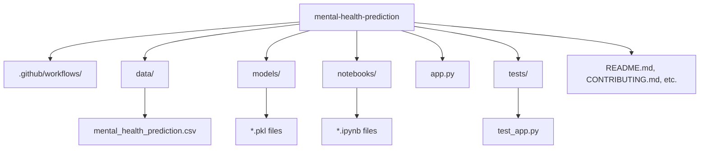
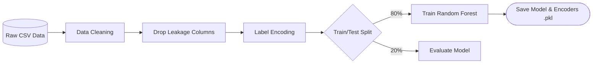
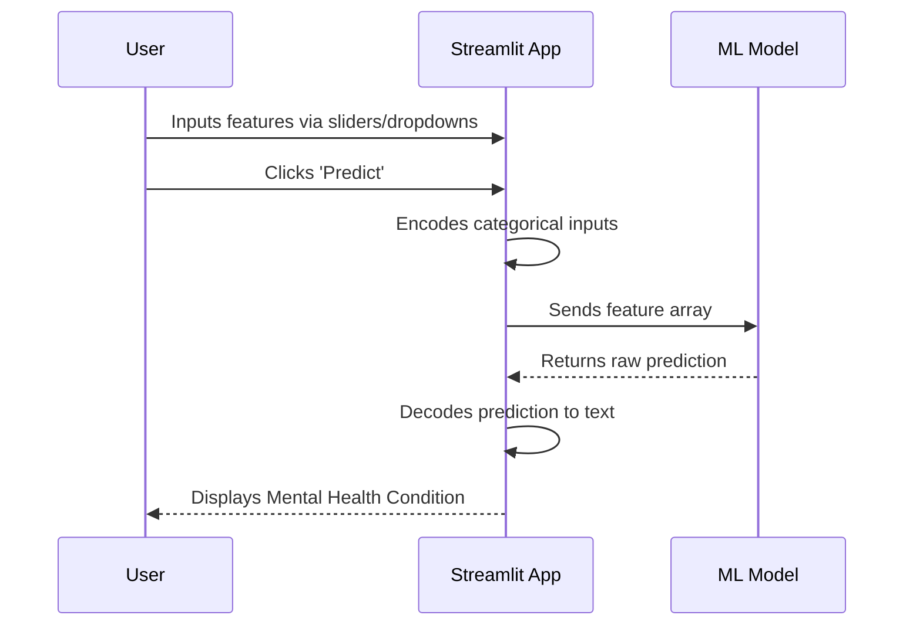

# Mental Health Condition Predictor


A complete, production-ready Machine Learning pipeline and interactive web application for predicting mental health conditions based on demographic, lifestyle, and psychological factors.

---

## 📌 Project Overview

Mental health is a critical aspect of overall well-being. This project leverages Machine Learning (Random Forest) to predict an individual's potential mental health condition (e.g., Normal, Anxiety, Depression) by analyzing various lifestyle indicators such as sleep quality, academic/work pressure, and social media usage.

## 🎯 Problem Statement

Early identification of mental health conditions can lead to better support and timely interventions. The objective of this project is to build a reliable predictive model that maps daily habits and psychological scores to a specific mental health condition, helping users gauge their well-being through an intuitive web interface.

## ✨ Features

- **End-to-End ML Pipeline**: From data preprocessing and feature engineering to model training and evaluation.
- **High Accuracy**: Utilizes a Random Forest Classifier achieving ~95% test accuracy.
- **Interactive UI**: Built with Streamlit for a seamless, user-friendly experience.
- **Real-Time Predictions**: Instantaneous feedback based on user inputs.
- **Production-Ready**: Adheres to PEP 8 standards, includes unit tests, and integrates CI/CD via GitHub Actions.

---

## 📊 Dataset Description

The dataset `mental_health_prediction.csv` contains numerous features impacting mental health:
- **Demographics**: `age`, `gender`, `occupation`
- **Lifestyle Metrics**: `sleep_hours`, `sleep_quality`, `social_media_hours`, `physical_activity_days`
- **Psychological Scores**: `academic_work_pressure`, `stress_level`, `anxiety_score`, `depression_score`, `work_life_balance`, `mood_score`, `concentration_level`, `social_support`
- **Target Variable**: `mental_health_condition`

*Note: Leakage features (`severity` and `treatment`) are deliberately dropped during training.*

---

## 🏗️ Architecture & Workflows

### 1. Folder Structure



### 2. Machine Learning Pipeline



### 3. Application Workflow



---

## ⚙️ Installation

1. **Clone the repository**
   ```bash
   git clone https://github.com/yourusername/mental-health-prediction.git
   cd mental-health-prediction
   ```

2. **Create a virtual environment (optional but recommended)**
   ```bash
   python -m venv venv
   source venv/bin/activate  # On Windows use: venv\Scripts\activate
   ```

3. **Install dependencies**
   ```bash
   pip install -r requirements.txt
   ```

---

## 🚀 Usage

### Running the Streamlit App
To launch the interactive web app locally, run:
```bash
streamlit run app.py
```
The application will open in your default web browser at `http://localhost:8501`.

### Running Tests
To ensure everything is working correctly:
```bash
pytest tests/
```

---

## 📈 Performance Metrics

- **Algorithm**: Random Forest Classifier
- **Training Accuracy**: 100%
- **Testing Accuracy**: ~94.9%
- The model successfully generalizes well without significant overfitting.

---

## 🔮 Future Improvements

- [ ] Connect a live database to track user predictions over time.
- [ ] Add SHAP (SHapley Additive exPlanations) values to explain *why* the model made a certain prediction.
- [ ] Expand the dataset for greater demographic diversity.
- [ ] Containerize the application using Docker for easier deployment.

---

## 💻 Technologies Used

- **Python 3.8+**
- **Pandas & NumPy**: Data manipulation and numerical operations
- **Scikit-Learn**: Machine Learning algorithms and preprocessing
- **Streamlit**: Web application framework
- **Pytest**: Unit testing
- **GitHub Actions**: Continuous Integration

---

## 📝 License

This project is licensed under the MIT License - see the [LICENSE](LICENSE) file for details.
